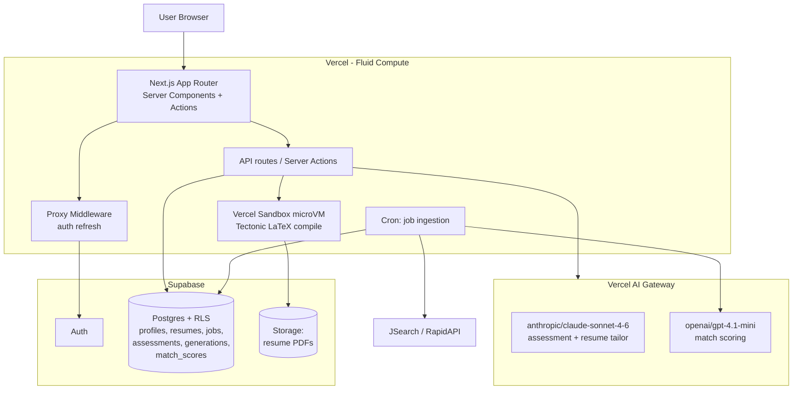

# NOTES.md

Single source of long-term, slowly-changing knowledge. Sectioned. Read only the section you need. Split a section into its own file when it crosses ~250 lines AND has clear topical isolation.

---

## Project

| Key            | Value                                                                  |
|----------------|------------------------------------------------------------------------|
| Working name   | CareerForge (placeholder; real name TBD)                               |
| One-line pitch | AI-native career platform: candid assessment + roadmap + verified jobs + on-click tailored bundle |
| Target user v1 | Job seekers and students in India, Delhi NCR primary                   |
| Solo or team   | Solo developer + Claude Code as force multiplier                       |
| Timeline       | No hard deadline; "build until working, then onboard, then paid"       |
| Monetization   | Free during beta; paid tiers post-beta; structure TBD                  |
| Distribution   | Direct-to-user web app                                                 |

## Differentiators (the moat — protect in every design decision)

1. Candid, rubric-grounded profile assessment — not generic LLM flattery.
2. Personalized roadmap with curated free YouTube + paid certification mappings.
3. Multi-source job aggregation with a legitimacy/trust scoring layer (filter ghost jobs).
4. One-click tailored bundle per job: resume, cover letter, interview Qs, outreach drafts, company brief.
5. Profile-vs-role match score + (post-beta only) realistic-chance estimate based on aggregated outcomes.
6. Portfolio + LinkedIn analysis as part of the assessment — paste-in / PDF only, no auto-fetch.
7. Recommended next steps (projects, courses, certifications, networking) tied to specific gaps.

## Constraints

- **Solo dev.** Surface area minimization is the single biggest predictor of shipping.
- **Free beta.** Cost ceiling matters; aggressive prompt caching from day one.
- **India-first.** Job source coverage of Indian roles (JSearch India filter for Slice 1; Greenhouse/Lever/Ashby ATS adds in Slice 4).
- **LinkedIn ToS.** Auto-fetch is off-limits. Paste-in / user-supplied PDF only.
- **Naukri/Internshala scraping.** Off-limits in v1; revisit only if aggregator coverage proves clearly insufficient.

## Stack

(See CLAUDE.md `## Stack snapshot` for the canonical list. This section explains *why* each choice was made; the choices themselves live there.)

- **Next.js full-stack on Vercel:** chosen over the originally-proposed Next.js + FastAPI/Render split because solo-dev ops surface dominates everything else. Fluid Compute removes the "you need Python for backend" assumption (300s timeout, full Node.js, instance reuse).
- **Vercel AI Gateway:** chosen as the LLM abstraction so we can swap secondary models per-call without code changes. Critical because we *will* A/B test scoring models.
- **Vercel Workflow DevKit:** chosen for the on-click multi-agent bundle. Durable, pause/resume, retries, crash-safe orchestration. Saves ~3 weeks of infra work vs. building this on a queue + state machine ourselves.
- **Vercel Sandbox:** chosen for any Python-only deps (JobSpy primarily). Single Render worker is the fallback if Sandbox cold-start or pricing becomes a problem.
- **Supabase:** Postgres + Auth + RLS + Storage in one. Standard pick. RLS is the security boundary for resume PII.
- **Tectonic for LaTeX:** chosen over a hosted LaTeX service for cost control + offline-friendliness. Compiled inside Vercel Sandbox.

---

## Domain

### ATS (Applicant Tracking Systems)

- ATS systems parse resumes into structured fields. They penalize: tables, columns, headers/footers with key info, images, fancy fonts, embedded text-in-graphics.
- ATS-friendly resumes: single column, standard fonts (Latin Modern, Computer Modern, Helvetica, Times), section headings ATS expects ("Experience", "Education", "Skills"), bullet points (not nested deeply), reverse-chronological.
- Most major ATS (Greenhouse, Lever, Ashby, Workday) have public schemas / endpoints for jobs (ingestion-friendly). Naukri/Internshala do not.
- **Schema.org JobPosting** is the de-facto canonical job schema. Our internal `jobs` row should be ingestible to/from this.

### Ghost jobs (jobs that aren't real or aren't actively being filled)

Common indicators (rule-based first pass):
- Listed for >60 days without re-posting.
- Same listing copy across many companies (paste-bot networks).
- Vague JD with no concrete responsibilities or stack.
- Recruiter-of-record domain doesn't match company domain.
- Same recruiter posts >50 listings/week across unrelated industries.
- "Always hiring" pages without team-size signals.

LLM second pass evaluates the listing text against above signals + provides a trust score 0–100 with a reasoning string the user can see.

### India job-market specifics

- ITES vs product company patterns differ substantially (ITES = service-economy English-skill-heavy; product = engineering-skill-heavy). Resume tailoring should detect role family.
- Common role families in NCR: SDE/SWE, Data/ML, Product, Design, DevOps/SRE, Sales, Marketing, Ops, Finance, HR.
- Salary signals are noisy in India listings — many list ranges in lakhs/annum, some omit entirely. Our match score must not over-weight salary alignment.

### LaTeX in our pipeline (gotchas)

- Tectonic is the compiler. Single binary, no `tlmgr` mess.
- We do **not** generate raw LaTeX from an LLM. We use the **edit-via-JSON pattern**: a stable LaTeX template + a JSON document representing the resume + a deterministic transformer that fills the template.
- LLM only emits **structured edit instructions** (e.g., `{ "section": "experience", "index": 2, "field": "bullet1", "new_value": "..." }`) which a typed reducer applies.
- This pattern eliminates the entire class of LaTeX-syntax bugs from LLM output.
- Compilation happens in Vercel Sandbox (microVM), result PDF stored in Supabase Storage.
- Templates: start with one ATS-friendly single-column template. Two more in Slice 3 (one mid-density, one design-leaning).

### LinkedIn boundaries

- We do **not** scrape, automate fetch, or use undocumented APIs against LinkedIn.
- We **do** accept user-pasted profile text or user-uploaded LinkedIn-exported PDFs ("Save to PDF" feature on LinkedIn).
- All LinkedIn analysis features clearly indicate "paste your profile" or "upload exported PDF" in UI copy.

---

## Glossary

| Term                  | Definition                                                                                       |
|-----------------------|--------------------------------------------------------------------------------------------------|
| Slice                 | A vertical, end-to-end usable feature increment that ships independently. We have 5 of them.     |
| Bundle                | The on-click set of artifacts generated for a single (user, job) pair.                           |
| On-click bundle       | Triggered when user clicks a job in the feed; assembles bundle artifacts in parallel.            |
| Match score           | 0–100 score representing skills/role/experience overlap between profile and JD. Computed by secondary LLM. |
| Trust score           | 0–100 score representing legitimacy of a job listing. Rules + LLM hybrid.                        |
| Realistic chance      | Estimate of probability of getting interview/offer for a role. Deferred to post-beta when outcome data exists. |
| Edit-via-JSON         | Resume engineering pattern: stable template + JSON state + LLM emits edit ops, never raw LaTeX.  |
| Rubric                | Structured scoring criteria the assessment engine grades against, per role family.               |
| Role family           | Coarse-grained job category: SWE, Data/ML, Product, Design, DevOps, Sales, Marketing, etc.       |
| Fluid Compute         | Vercel's default function runtime; instance reuse, 300s timeout, full Node.js, near-zero cold start. |
| AI Gateway            | Vercel's unified LLM proxy. We call models via `provider/model` strings (e.g., `anthropic/claude-sonnet-4-6`). |
| Workflow DevKit       | Vercel WDK — durable workflow runtime with pause/resume, retries, crash-safe state.              |
| Sandbox               | Vercel Sandbox — ephemeral microVM for running untrusted or Python-only code.                     |
| Tectonic              | Self-contained LaTeX compiler used for resume PDF generation.                                    |
| RLS                   | Row-Level Security in Postgres/Supabase — our user-isolation security boundary.                  |
| JSearch               | RapidAPI-fronted job aggregator; v1 sole job source.                                             |
| JobSpy                | Python library that scrapes multiple job boards; runs in Vercel Sandbox if/when needed.          |
| ATS                   | Applicant Tracking System (Greenhouse, Lever, Ashby, Workday, etc.).                             |

---

## Models

Filled 2026-04-27 (Phase 1). Revisit when (a) we have real scoring-prompt traffic to calibrate against, or (b) any provider drops headline pricing >25%.

### Routing layer: Vercel AI Gateway (confirmed)

All LLM calls go through Vercel AI Gateway via plain `provider/model` strings. Reasons:
- **Zero markup** — passthrough pricing identical to upstream provider list price.
- **Automatic failover** between providers; per-provider timeouts configurable.
- **One-line model swaps** without code changes — critical because we *will* A/B test scoring models in Slice 1.
- **BYOK supported** — we can plug provider keys directly if we ever want to bypass gateway billing.
- **Unified dashboard** — single place to watch token spend across providers.

Implementation: `model: 'provider/model-id'` in AI SDK calls (e.g., `model: 'anthropic/claude-sonnet-4-6'`). Default global provider via `globalThis.AI_SDK_DEFAULT_PROVIDER` in `instrumentation.ts`.

### Workload → model mapping (revised 2026-04-29)

**Cost-policy rule:** Sonnet only for moat features. Mini for everything else, no exceptions. New features default to mini; Sonnet requires explicit justification (must be brand-defining + voice-critical).

| Workload                                                            | Model                            | Why                                                                                                       |
|---------------------------------------------------------------------|----------------------------------|-----------------------------------------------------------------------------------------------------------|
| **Profile assessment** (rubric-grounded, candid voice — the brand)  | `anthropic/claude-sonnet-4-6`    | Multi-section rubric depth + naturally calibrated "candid without mean" voice + grounded evidence extraction. Mini's voice slips into generic AI prose. |
| **Resume tailoring** (edit-via-JSON, coherence-critical)            | `anthropic/claude-sonnet-4-6`    | Cross-section coherence (voice, dates, quantification) is where mini fails most visibly. The resume is the most-shared artifact — quality is brand. |
| **Everything else** — cover letter, company brief, interview Qs, outreach drafts, practice mode, roadmap synthesis, job match scoring, ghost-job classification, resume parsing, job extraction (paste-a-job), **career agent (Slice 3)**, memory distiller, thread summarizer | `openai/gpt-4.1-mini` | Cost-policy rule. Mini is good enough at every non-moat task at 1/8 the cost. The career agent reaches mini specifically at user's 2026-04-29 directive — voice tradeoff accepted vs. cost. |
| Embeddings (Slice 4+)                                               | TBD — Voyage v4 or `openai/text-embedding-3-large` | Decide when we know corpus size + recall targets.                                                      |

**Dropped from Sonnet (was on prior version of this map):**
- ~~Orchestrator~~ — pattern abandoned. Slice 2 uses lazy per-button artifact generation, not multi-agent orchestration. No orchestrator role exists.
- ~~Career agent~~ — was Slice 3 plan to put on Sonnet for tool-use accuracy. Moved to mini per cost policy. Mini's tool-use is ~95% accurate (vs Sonnet's ~99%); the 4% gap is acceptable for $0.10→$0.01 per agent turn.

**Why we did NOT default to Gemini 2.5 Flash-Lite for scoring** (user override 2026-04-27): Flash-Lite is ~4× cheaper but its strict-JSON reliability lags GPT-4.1 mini. Held in reserve via AI Gateway — one-line swap available if production-scale cost on mini becomes the bottleneck.

### Comparison table (April 2026, per 1M tokens via AI Gateway list price)

| Model                            | Input $   | Output $   | Context  | Notes                                                                  |
|----------------------------------|-----------|------------|----------|------------------------------------------------------------------------|
| `anthropic/claude-sonnet-4-6`    | $3.00     | $15.00     | 1M       | Cache read $0.30 (10% of input). Batch API halves all costs.           |
| `anthropic/claude-haiku-4-5`     | $1.00     | $5.00      | 1M       | **Excluded per user constraint.** Listed for reference only.           |
| `google/gemini-2.5-flash`        | $0.30     | $2.50      | 1M       | Released Jun 2025. GA.                                                 |
| `google/gemini-2.5-flash-lite`   | **$0.10** | **$0.40**  | 1M       | Released Jul 2025. GA. ~328 tok/s (fastest cheap class).               |
| `openai/gpt-4o-mini`             | $0.15     | $0.60      | 128K     | Older; superseded by 4.1-mini for our needs.                           |
| `openai/gpt-4.1-mini`            | $0.40     | $1.60      | 1M       | Strongest strict-JSON output in class.                                 |
| `deepseek/deepseek-v3.2`         | $0.28     | $0.42      | 163K     | Cache hit $0.028/M (very cheap repeat). Strong reasoning. JSON mode less mature. |
| `deepseek/deepseek-v4`           | ~$0.30    | ~$0.50     | larger   | Mar 2026 release. Likely promoted to fallback later if quality holds.  |
| `mistral/mistral-small-3.1`      | $0.20     | $0.60      | varies   | Solid mid-tier; no decisive edge over Flash-Lite for our workload.     |
| `xai/grok-3-mini`                | $0.30     | $0.50      | 128K     | Fine, no decisive edge.                                                |
| `qwen/qwen-3-32b`                | $0.70     | $2.80      | varies   | Too expensive for the workload.                                        |

### Per-bundle cost (revised after 2026-04-27 split)

Per on-click bundle (one user clicks one job → orchestrator + 5 sub-agents):

| Component                                | Model            | Cost per call (no cache) |
|------------------------------------------|------------------|--------------------------|
| Orchestrator (~3K in / 500 out)          | Sonnet 4.6       | ~$0.017                  |
| Resume tailoring (~5K in / 2K out)       | Sonnet 4.6       | ~$0.045                  |
| Cover letter (~3K in / 1K out)           | GPT-4.1 mini     | ~$0.0028                 |
| Interview Qs (~3K in / 1.5K out)         | GPT-4.1 mini     | ~$0.0036                 |
| Outreach drafts (~2K in / 0.5K out)      | GPT-4.1 mini     | ~$0.0016                 |
| Company brief (~3K in / 1K out)          | GPT-4.1 mini     | ~$0.0028                 |
| **Total per bundle (no cache)**          |                  | **~$0.073**              |
| **Total per bundle (with caching)**      |                  | **~$0.040**              |

### Per-user-month estimates

| User profile                   | Bundles/mo | Scoring calls/mo | Assessment | Sonnet $ | Mini $ | **Total cached** |
|--------------------------------|------------|------------------|------------|----------|--------|------------------|
| Light beta user                | 30         | 1,500            | 1×         | ~$2.20   | ~$0.30 | **~$2.50**       |
| Heavy beta user                | 200        | 4,500            | 2×         | ~$13.50  | ~$1.80 | **~$15.30**      |

### Aggregate cost projections

| Stage                                        | LLM cost/month       |
|----------------------------------------------|----------------------|
| Beta — 50 users mixed usage                  | ~$300–500            |
| Beta — 50 heavy users                        | ~$700–900            |
| Production — 1,000 users mixed               | ~$8,000–10,000       |
| Production — 1,000 users with heavy usage    | ~$15,000–19,000      |

Implication: free beta is fine on this stack. Paid tiers must be live before crossing ~500 active users — that's the cost-discipline line.

### Caching strategy (must be wired Slice 1)

Every Sonnet call uses prompt caching aggressively:
- **System prompts + rubrics** (cached, change rarely) → 10% of input cost on cache hits.
- **User profile** (cached for 5min/1hr per session) → 10% on cache hits.
- **Few-shot examples + role-family templates** (cached) → 10% on cache hits.
- Only the **JD + edit instructions** are fresh tokens.

Target: 70%+ of input tokens served from cache. Effective Sonnet input cost drops from $3 → ~$1.10 per 1M.

For mini: OpenAI's automatic prompt caching kicks in on prefix matches >1024 tokens, no SDK changes needed.

### Revisit triggers

- **Production-scale cost on mini exceeds budget** — swap mini scoring/classification calls to `google/gemini-2.5-flash-lite` (one-line change via AI Gateway). At 1,000 users this saves ~$5K/mo on scoring alone.
- **Mini quality dips on coherence-light tasks** — promote a slice (e.g., interview Qs) back to Sonnet.
- **DeepSeek V4 / Gemini 3.x Flash-Lite GA pricing drops** below current floor — re-evaluate scoring default.
- **Sonnet drift on assessment** (rare) — investigate prompt before swapping.
- **OpenAI raises mini pricing** — Flash-Lite waiting in reserve.

### What we deliberately did NOT pick, and why

- **Haiku 4.5** — excluded per your standing constraint. Pricing also poor for the workload.
- **Gemini 2.5 Flash-Lite as default** — 4× cheaper than mini for scoring/classification, but user judged JSON reliability gap not worth the savings at beta scale. Held in reserve.
- **All-Sonnet** — quality-maximalist; rejected on cost (~$10/user/mo cached vs ~$3.50 split).
- **All-mini for heavyweight** — would compromise assessment + resume quality, the moat features. Brand risk too high.
- **DeepSeek V3.2/V4** — strong reasoning, cheap on cache hits, but JSON-mode reliability lags Google/OpenAI. "Promote candidate" only.
- **Qwen3 32B** — too expensive; no decisive edge.
- **Mistral Small / Grok 3 Mini** — fine, no decisive advantage. Skipped to avoid provider sprawl.
- **Direct provider SDKs** — only when a provider-specific feature demands it (e.g., Anthropic computer-use, citations, extended-thinking control). Default = AI Gateway `provider/model` strings.

### Confidence + revisit triggers

- **Cost ranking:** very high confidence. Public list prices, all sourced.
- **Quality match for scoring:** medium confidence. Depends on rubric specifics. We'll know after the Slice 1 shadow run.
- **Revisit when:** any default provider drops headline price >25%; or shadow drift exceeds the 5-point/10% threshold; or a new sub-$0.10 input-price GA model lands; or Anthropic releases a sub-Haiku tier.

### Sources

- [Vercel AI Gateway pricing docs](https://vercel.com/docs/ai-gateway/pricing)
- [Vercel AI Gateway models & providers](https://vercel.com/docs/ai-gateway/models-and-providers)
- [Anthropic Claude API pricing](https://platform.claude.com/docs/en/about-claude/pricing)
- [Claude API Pricing Guide 2026 (devtk)](https://devtk.ai/en/blog/claude-api-pricing-guide-2026/)
- [Gemini API pricing (Google AI for Devs)](https://ai.google.dev/gemini-api/docs/pricing)
- [Gemini 2.5 Flash-Lite GA announcement](https://developers.googleblog.com/en/gemini-25-flash-lite-is-now-stable-and-generally-available/)
- [OpenAI API pricing](https://openai.com/api/pricing/)
- [GPT-4.1 mini pricing (pricepertoken)](https://pricepertoken.com/pricing-page/model/openai-gpt-4.1)
- [DeepSeek API pricing docs](https://api-docs.deepseek.com/quick_start/pricing)
- [Artificial Analysis leaderboard](https://artificialanalysis.ai/leaderboards/models)

---

## Architecture

Scope: **Slice 1 only**. Filled 2026-04-27 (Phase 2). Any addition for later slices goes in their own section when those slices begin.

### Slice 1 user journey (canonical)

1. Sign up (Supabase Auth, email + Google OAuth).
2. Onboarding: pick `target_role_family` + `target_seniority` + `target_location`.
3. Upload resume (PDF/text) → parse → `resume_json` stored on profile.
4. Optional: paste LinkedIn export, add portfolio URLs.
5. Run profile assessment (Sonnet) → rubric-grounded scores + gaps + strengths.
6. Job feed populates from JSearch (India filter, target role family). Each job lazy-scored on view.
7. User clicks a job → tailored resume generated (Sonnet edit-via-JSON → LaTeX → Tectonic in Vercel Sandbox → PDF).
8. User downloads PDF.

That's it. Cover letter / interview Qs / outreach / brief / roadmap / multi-source / LinkedIn auto-fetch / "realistic chance" / ghost-job detection — all later slices.

### Component diagram



### Data model (Postgres / Supabase, Slice 1 only)

Six tables. All user-data tables get RLS owner-only. `jobs` is shared-read, service-role-write.

```
profiles
  id                       uuid PK == auth.users.id
  display_name             text
  target_role_family       enum(swe, data_ml, product, design, devops, sales, marketing, ops, other)
  target_seniority         enum(intern, entry, mid, senior, staff)
  target_location          text default 'Delhi NCR'
  linkedin_paste           text nullable
  portfolio_urls           text[] default '{}'
  resume_json              jsonb nullable                -- canonical structured resume
  raw_resume_text          text nullable                 -- original text for re-parse
  latest_assessment_id     uuid fk assessments.id nullable
  created_at, updated_at   timestamptz

resumes                                                 -- versions; tailored copies live here too
  id                       uuid PK
  profile_id               uuid fk profiles.id
  source                   enum(upload_pdf, upload_text, ai_tailored)
  resume_json              jsonb
  raw_text                 text nullable
  parent_resume_id         uuid fk resumes.id nullable   -- tailored → base
  target_job_id            uuid fk jobs.id nullable      -- only set for ai_tailored
  pdf_url                  text nullable                 -- Supabase Storage path
  compile_status           enum(pending, compiling, success, failed)
  compile_error            text nullable
  created_at               timestamptz

jobs                                                     -- shared, deduped
  id                       uuid PK
  source                   enum(jsearch, greenhouse, lever, ashby)  -- Slice 1: jsearch only
  source_id                text                          -- id from source, dedup key
  source_url               text
  title, company, location text
  description              text
  description_parsed       jsonb nullable                -- extracted skills/reqs, cached
  posted_at                timestamptz nullable
  raw                      jsonb                         -- full source payload
  created_at, last_seen_at timestamptz
  UNIQUE(source, source_id)

assessments
  id                       uuid PK
  profile_id               uuid fk profiles.id
  rubric_version           text                          -- e.g., "v1.swe.2026-04"
  model                    text                          -- 'anthropic/claude-sonnet-4-6'
  overall_score            int                           -- 0-100
  dimensions               jsonb                         -- {technical:{score,evidence,gaps,strengths}, ...}
  candid_summary           text                          -- headline narrative
  next_steps               jsonb                         -- [{priority, action, why, time_estimate}]
  raw_response             jsonb                         -- full LLM response for debug
  prompt_tokens            int
  completion_tokens        int
  cached_tokens            int
  created_at               timestamptz

generations                                              -- artifacts of on-click work
  id                       uuid PK
  profile_id               uuid fk profiles.id
  job_id                   uuid fk jobs.id
  kind                     enum(resume_tailoring)        -- Slice 1 only this; Slice 2 adds the rest
  status                   enum(pending, generating, success, failed)
  output                   jsonb nullable                -- edit ops applied (for resume_tailoring)
  resume_id                uuid fk resumes.id nullable   -- the materialized tailored resume row
  error                    text nullable
  model                    text
  prompt_tokens, completion_tokens, cached_tokens int
  created_at, completed_at timestamptz

match_scores                                             -- per profile×job, idempotent
  id                       uuid PK
  profile_id               uuid fk profiles.id
  job_id                   uuid fk jobs.id
  score                    int                           -- 0-100
  reasoning                text
  gaps                     text[]                        -- top 3 missing skills
  strengths                text[]                        -- top 3 overlaps
  model                    text
  created_at, updated_at   timestamptz
  UNIQUE(profile_id, job_id)
```

`pgvector` and `embeddings_cache` deferred to Slice 4 when ghost-job detection needs semantic dedup.

### RLS policies (sketch)

| Table         | SELECT                          | INSERT                          | UPDATE             | DELETE             |
|---------------|---------------------------------|---------------------------------|--------------------|--------------------|
| profiles      | `auth.uid() = id`               | `auth.uid() = id`               | own only           | own only           |
| resumes       | own (via profile_id)            | own                             | own                | own                |
| assessments   | own (via profile_id)            | own (server-action gated)       | none (immutable)   | own                |
| generations   | own                             | own (server-action gated)       | system (status updates by service_role) | own |
| match_scores  | own                             | service_role only               | service_role only  | service_role only  |
| jobs          | authenticated (any)             | service_role only               | service_role only  | service_role only  |

### API surface (Slice 1)

Server Actions where the call originates from a Server Component; REST routes where polling or external triggers are required.

| Method/Kind     | Path / Action                       | Purpose                                                 |
|-----------------|-------------------------------------|---------------------------------------------------------|
| Server Action   | `updateProfile(formData)`           | Upsert basic profile fields                             |
| Server Action   | `uploadResume(file)`                | Parse PDF/text → `resume_json` + raw_text on profile    |
| Server Action   | `runAssessment()`                   | Idempotent: returns latest if <7d, else fires Sonnet    |
| GET             | `/api/jobs?cursor=&limit=`          | Feed with eager+lazy match scores                       |
| Server Action   | `requestTailor(jobId)`              | Insert `generations` row, fire Sonnet, return id        |
| GET             | `/api/generations/:id`              | Poll status (pending/generating/success/failed)         |
| GET             | `/api/generations/:id/pdf`          | Redirect to signed Storage URL                          |
| Internal cron   | `/api/cron/ingest-jobs`             | JSearch India fetch → upsert `jobs` (Vercel cron daily) |
| Internal        | `/api/internal/match-score`         | Triggered lazily from feed; service_role inserts        |

Auth routes are Supabase's stock callbacks (`/auth/callback`).

### Agent orchestration — resume tailoring (Slice 1: single-pass)

Slice 1 keeps it simple. **No Workflow DevKit yet** — that lands in Slice 2 with the on-click multi-agent bundle.

Flow:
1. Server Action `requestTailor(jobId)` → INSERT `generations` (status=pending, kind=resume_tailoring) → return id immediately.
2. Background work (in same Fluid Compute invocation, runs after response sent via `waitUntil`):
   1. Fetch `profile.resume_json` + `job.description` + `job.description_parsed`.
   2. Call Sonnet with **prompt-cache-friendly structure** (see Caching below).
   3. Parse response: `{ edit_ops: [{ section, index, field, new_value, reason }, ...] }`.
   4. Apply edit_ops to `resume_json` → `tailored_resume_json`.
   5. INSERT `resumes` row (source=ai_tailored, parent_resume_id, target_job_id, compile_status=compiling).
   6. Render LaTeX from `tailored_resume_json` + ATS-friendly template.
   7. POST to Vercel Sandbox endpoint with LaTeX source → Tectonic compile → PDF bytes.
   8. Upload PDF to Supabase Storage → store URL on `resumes.pdf_url`.
   9. UPDATE `resumes.compile_status=success`, `generations.status=success, completed_at=now()`.
3. Frontend polls `/api/generations/:id` every 2s; redirects to PDF on success.

Failure modes (each writes status=failed + error string):
- Sonnet returns malformed edit_ops → reject + show user "regenerate".
- LaTeX compile error → log raw .tex for debug, fall back to plain HTML resume in Slice 1 (defer PDF perfection to Slice 2 polish).
- Sandbox cold start >10s → still acceptable (user is in polling UI).

### Caching strategy (mandatory from Slice 1)

#### Anthropic prompt caching — every Sonnet call

Structure each Sonnet message so cache breakpoints maximize hits:

```
[1] System prompt + rubric        ← cached 1hr (rare changes, version-gated)
[2] User profile context block    ← cached 5min (per-session profile)
[3] Few-shot edit-op examples     ← cached 1hr (ships with prompt version)
--- cache breakpoint ---
[4] JD + user instruction         ← always fresh
```

Target: **70%+ input tokens served from cache** on the 2nd+ call within a session. Effective Sonnet input cost drops $3 → ~$1.10 per 1M.

#### Application-level cache (Postgres rows; no Redis in Slice 1)

| Cache                   | Key                          | TTL / invalidation                                      |
|-------------------------|------------------------------|---------------------------------------------------------|
| `match_scores`          | `(profile_id, job_id)`       | Permanent until `profiles.resume_json` changes; bump on profile update → soft-invalidate (mark stale) |
| `jobs.description_parsed` | `jobs.id`                  | Permanent (re-parse only if extraction logic changes)   |
| Compiled resume PDF     | `(profile_id, job_id, resume_json hash)` | Permanent; new tailor call creates new resume row |

#### Vercel Runtime Cache (post-Slice-1 if hot paths emerge)

Skipped in Slice 1 — Postgres-backed cache is fine at 100 users. Revisit if feed page-load >2s.

### Cost model — Slice 1 at 100 users

Mix: 90 typical + 10 heavy. Per-user/month estimates with caching wired:

| Activity                          | Typical user      | Heavy user          |
|-----------------------------------|-------------------|---------------------|
| Assessment (Sonnet, 50% cache)    | 1 × $0.08 = $0.08 | 2 × $0.08 = $0.16   |
| Match scoring (mini)              | 20 × $0.0035 = $0.07 | 150 × $0.0035 = $0.53 |
| Resume tailoring (Sonnet, 70% cache) | 5 × $0.040 = $0.20 | 30 × $0.040 = $1.20 |
| LaTeX compile (Sandbox)           | 5 × $0.005 = $0.025 | 30 × $0.005 = $0.15 |
| Job ingest cron (mini, prorated)  | $0.10             | $0.10               |
| **Per-user total**                | **~$0.48**        | **~$2.14**          |

**100 users (90 typical + 10 heavy):** 90 × $0.48 + 10 × $2.14 = **~$65/month LLM + Sandbox spend.**

Plus infra:
- Vercel Hobby: $0 (free until paid features needed)
- Supabase Free: $0 (500MB DB, 1GB Storage, 50K MAU — well under)
- JSearch RapidAPI: $10/mo basic plan (free tier 50 req/day insufficient)
- **Total Slice 1 at 100 users: ~$75–80/month.**

At 500 users (cost-discipline gate): projects to ~$400/month — still pre-paid-tier-launch budget.

### Slice 1 scope — what's NOT included (re-stating for ruthless clarity)

| Feature                                       | Slice |
|-----------------------------------------------|-------|
| Cover letter, interview Qs, outreach, brief   | 2     |
| On-click full multi-agent bundle              | 2     |
| Workflow DevKit orchestration                 | 2     |
| Roadmap engine + curated skill→resource map   | 3     |
| Portfolio + LinkedIn analysis (paste-in only) | 3 + 5 |
| Multi-source ingestion (Greenhouse/Lever/Ashby) | 4   |
| Ghost-job detection                           | 4     |
| Vector embeddings + semantic match            | 4     |
| "Realistic chance" estimator (calibrated)     | 5     |
| LinkedIn paste-in + PDF analysis              | 5     |

### Brutal-honesty review

#### Top 3 risks in Slice 1

1. **Resume parser quality.** PDF extraction is the rockiest unknown. Multi-column layouts, embedded tables, and design-heavy resumes produce garbage when run through generic PDF→text. If 30%+ of uploads parse poorly, users churn before seeing the assessment value. **Mitigation:** ship with "paste your resume text" as the first-class option; PDF upload is best-effort. Add explicit "verify extracted fields" step before assessment.
2. **Assessment voice calibration.** "Candid not mean" is a prompt-engineering moving target. First version will skew either soft (LLM default) or harsh (overcorrection). The brand promise dies on either failure mode. **Mitigation:** rubric_version field in DB → easy A/B; manually grade first 50 beta assessments before any wider rollout.
3. **JSearch coverage in India.** JSearch indexes major boards but Indian-specific roles (smaller startups, ITES, contract roles) coverage is unknown. A sparse feed kills downstream funnel — no clicks, no bundles. **Mitigation:** measure feed density per role family in week 1 of beta; if too sparse, accelerate Slice 4 (ATS endpoints) before Slice 2.

#### Top 3 things consciously deferred

1. **Cover letter / interview Qs / outreach / brief** — Slice 2. Slice 1 must prove assessment + tailored resume are valuable in isolation.
2. **Vector embeddings for match scoring** — replaced by direct LLM scoring in Slice 1. Saves a whole subsystem (pgvector, embedding pipeline, recall tuning). At 100 users, cached LLM scoring is fine; at 10K users, revisit.
3. **Workflow DevKit + queue infrastructure** — Slice 1 uses `waitUntil` for background work in Fluid Compute. WDK is overkill for a single Sonnet call + LaTeX compile. Comes online in Slice 2 when 5+ parallel agents need orchestrating.

#### Things we might second-guess later

- **Match scoring on view (lazy) vs ingest (eager).** Slice 1 chose lazy: scores computed on first feed render per (profile, job). Trade-off: first feed view is slow (10–20s for 50 jobs). Mitigation: paginate aggressively + compute in parallel. If unacceptable in beta, switch to eager-on-ingest (post-cron).
- **Single LaTeX template.** Slice 1 ships one ATS-friendly single-column. Two more templates in Slice 3. Risk: template too plain → users want fancy. Counter-evidence: ATS systems penalize fancy.
- **No prompt versioning UI.** Prompts live in code; iterate via deploy. Slice 4+ might need a UI if non-engineers want to tune.
- **No structured A/B framework.** Shadow-routing for scoring is hardcoded. If we need broader A/B, rebuild via a feature-flag library.

### Open decisions before Slice 1 build

| # | Decision                                           | Recommendation                              |
|---|----------------------------------------------------|---------------------------------------------|
| 1 | Auth provider                                       | **Supabase Auth** (free, in stack)          |
| 2 | JSearch transport                                   | **Direct from server** (key in env)         |
| 3 | Match scoring: eager (cron) vs lazy (on-view)       | **Lazy** with parallel-compute pagination   |
| 4 | Resume tailor UX: streaming vs poll                 | **Poll** (Slice 1); stream in Slice 2       |
| 5 | Initial role-family rubrics — how many?             | Just **swe + data_ml** for week 1 beta; expand based on user signups |
| 6 | LaTeX template author — pick existing OSS template? | Use `awesome-cv` or `medium-cv` as base; adapt for ATS-friendly single-column |
| 7 | Resume PDF parser library                           | `unpdf` (Vercel-friendly Node, no native deps); fallback to text-paste |

---

## Architecture extension (2026-04-29 — Slice 1 → Slice 2 reshape)

### Why this changed

Original Slice 2 plan: clicking a job auto-generates the entire bundle (cover letter + interview Qs + outreach + brief). User flagged: *"if someone applies, doesn't mean they interview today — wasted tokens."* Correct. Replace with **lazy per-button artifact generation** inside a per-job dashboard. Application tracker becomes the SHELL of Slice 2 instead of a separate Slice 3 feature.

### New flow

```
Feed (/jobs)  →  [Save] / [Apply] button on a card  →  creates an Application
                                                         │
Paste-a-job   →  URL or JD text  →  LLM extract  ────────┤
                                                         ▼
                          /applications  (the user's work board)
                                                         │
                                                         ▼
              /applications/[id]  (per-job dashboard — "the whole portal")
              ┌────────────────────────────────────────────────────┐
              │ Job header (title, company, score, JD)             │
              │ Status pills (Saved · Applied · Interview · Offer) │
              │ Notes textarea                                     │
              │ Artifact cards — each ON DEMAND:                   │
              │   📄 Tailored resume     [Generate]                 │
              │   ✍️ Cover letter        [Generate]                 │
              │   🏢 About this company  [Generate]                 │
              │   🎯 Interview questions [Generate]                 │
              │   💬 Outreach drafts     [Generate]                 │
              │   🎙️ Practice answers    [Start session] (Slice 2) │
              └────────────────────────────────────────────────────┘
```

Each artifact: own server action, own row in `generations` linked via `application_id`. State per card: not-generated → generating → generated (with timestamp + regenerate).

### New tables (Slice 1 Step 6c migration + Slice 2 prep)

```
applications
  id              uuid PK
  profile_id      uuid fk profiles.id
  job_id          uuid fk jobs.id
  status          enum(saved, applied, interview, offer, rejected, withdrawn)
  notes           text default ''
  applied_at      timestamptz nullable
  created_at, updated_at  timestamptz
  unique(profile_id, job_id)

practice_sessions          -- populated in Slice 2; declared now for stability
  id              uuid PK
  application_id  uuid fk applications.id
  question        text
  user_answer     text
  feedback        jsonb     -- { score, strengths[], improvements[] }
  created_at      timestamptz

generations
  + application_id  uuid fk applications.id NULLABLE   -- new column

jobs
  + created_by      uuid fk auth.users.id NULLABLE     -- new column
                                                      -- non-null = user-pasted entry
job_source enum
  + 'user_pasted' value                                -- new enum value
```

RLS:
- `applications`: own only (select/insert/update/delete via `auth.uid() = profile_id`).
- `practice_sessions`: select/insert via `application_id IN (own applications)`.
- `jobs` SELECT: rewritten to `created_by IS NULL OR created_by = auth.uid()` (public jobs + own pasted).
- `jobs` INSERT (new): `created_by = auth.uid() AND source = 'user_pasted'` — users can only insert their own paste-a-job entries; system jobs still service-role only.

### Paste-a-job intake

Two entry modes:
- **URL mode**: server fetches the URL, mini extracts `{ title, company, location, description }` from the HTML. User confirms before save.
- **JD text mode**: user pastes raw text; mini parses into the same shape.

Both create a `jobs` row with `source='user_pasted'`, `created_by=user.id`, then immediately create an `applications` row (status='saved') and run match scoring on it.

### Daily cron ingestion (Slice 4 — formalized)

Replaces on-demand `refreshFeed()` with a cron-driven background job:
- `vercel.ts`: `crons: [{ path: '/api/cron/ingest-jobs', schedule: '30 0 * * *' }]` (00:30 UTC = 06:00 IST).
- `/api/cron/ingest-jobs/route.ts`: verify `Authorization: Bearer ${CRON_SECRET}`, fetch from JSearch + Greenhouse + Lever + Ashby + AngelList for each role family, upsert into `jobs`.
- Match scoring stays lazy — runs per user when they hit `/jobs`, scoring only the unscored jobs for that profile.
- Keeps free-tier API budgets predictable (1 cron call/day vs. user-triggered hammering).

### What stays the same

- Sonnet for moat features (assessment, resume tailoring, orchestrator if added).
- Mini for everything else (parsing, scoring, all Slice 2 artifacts).
- 6-table data model is unchanged at its core; we add 2 tables (applications, practice_sessions) and 2 columns (generations.application_id, jobs.created_by).

---

## Lessons learned

*Append-only. Each entry: short rule + when/why discovered.*

- **2026-04-27 — Sonnet only for moat features, mini for everything else.** Sonnet 4.6 is decisively better on (1) multi-section rubrics, (2) cross-artifact coherence, (3) "candid not mean" voice, (4) tool-call accuracy. Everywhere else, GPT-4.1 mini wins on cost without visible quality loss. The 3 moat tasks (assessment, resume tailoring, orchestrator) define brand — don't cheap them. Everything else is supporting cast.
- **2026-04-27 — User preference: GPT-4.1 mini over Gemini Flash-Lite for scoring.** User judged Flash-Lite's JSON reliability inferior. Cost cost: ~4× ($6.5K/mo vs $1.6K/mo at 1k users). Acceptable in beta; revisit at production scale.
- **2026-04-27 — Prompt caching is non-optional from Slice 1.** Without it, Sonnet costs ~3× more. Architect every Sonnet call so system prompt + rubrics + profile are cacheable prefixes; only JD/edit-instructions are fresh.
- **2026-04-27 — Vercel CLI v52 regression on Preview env adds.** `vercel env add NAME preview --value VALUE --yes` returns `git_branch_required` despite the docs/help showing this exact form. Workaround: use the Vercel dashboard's "Copy to other environments" UI. Revisit when CLI updates. (Logged in LOG.md.)
- **2026-04-27 — On macOS without sudo or homebrew, install global npm packages to `~/.npm-global`.** `corepack enable` fails on `/usr/local/bin` symlink writes; standard `npm install -g` also fails. Configure `npm config set prefix ~/.npm-global` and append PATH to `~/.zshrc`. One-time setup, persists across shells.
- **2026-04-27 — `AI_GATEWAY_API_KEY` is auto-injected by Vercel runtime.** No manual provisioning needed. For local dev, `vercel env pull` gives a `VERCEL_OIDC_TOKEN` that the AI SDK gateway provider falls back to. Single source of truth: don't add `AI_GATEWAY_API_KEY` to `.env.local` manually.
